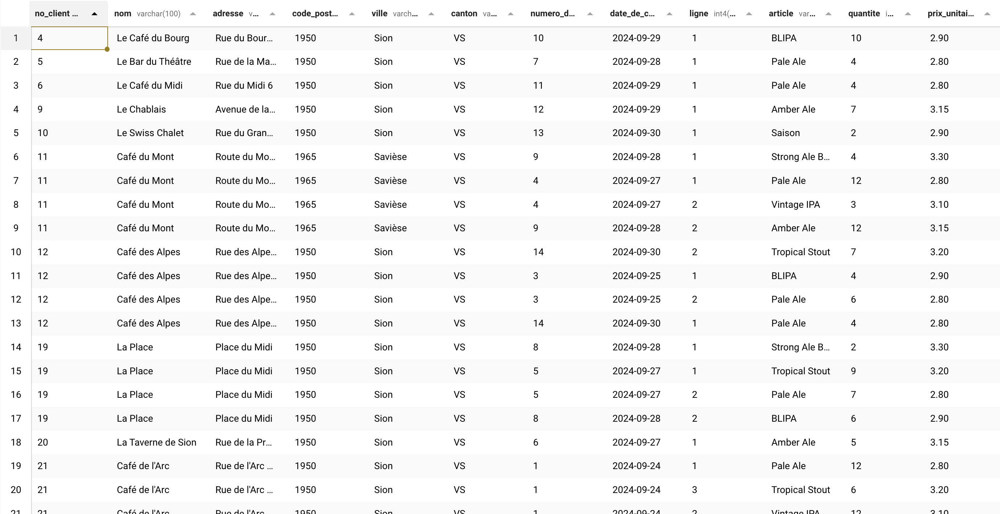

# Exercice de Normalisation de Base de Données

* Cours d'introduction au bases de données.
* HEVS.ch
* Renaud Richardet

## Objectif
Dans ce mini labo, vous allez normaliser une RDB étape par étape.

## Scénario
Votre meilleure amie travaille à la brasserie du Traquenard. Jusqu'ici elle a fait sa comptabilité dans une feuille Excel, mais la méthode montre ses limites. Elle aimerait que vous créiez une base de donnée pour gérer ses commandes. Comme vous êtes une personne méticuleuse, vous allez appliquer les principes de normalisation jusqu'à la troisième forme normale (3NF). Pour cela vous devrez identifier les dépendances fonctionnelles, créer des tables et relier celles-ci par des clés étrangères.



## Étape 1 : Récupération de la RDB initiale

Créez une nouvelle base de donnée (par exemple: serie_normalisation) puis populez-la avec le script [traquenard.sql](traquenard.sql).

Vous pouvez maintenant décider de réaliser vous-même tout seul les étapes de normalisation. 


Vous pouvez aussi réaliser pas-à-pas les consignes ci-dessous:


## Étape 2 : Structure de la RDB

Prenez le temps d'observer la structure actuelle de la table `Commandes_Version_Initiale` ainsi que les données qu'elle contient. Voici la structure :

| No_Client | Nom                | Adresse            | Code_Postal | Ville | Canton | Numéro_de_Commande | Date_de_Commande | Ligne | Article                | Quantité | Prix_Unitaire |
|-----------|--------------------|--------------------|-------------|-------|--------|--------------------|------------------|-------|------------------------|----------|---------------|
| 21 | Café de l'Arc | Rue de l'Arc 18 | 1950 | Sion | VS | 1 | 2024-09-24 | 2 | Vintage IPA | 12 | 3.10 |
| 23 | Café de l’Union | Rue de l’Union 1 | 1950 | Sion | VS | 2 | 2024-09-25 | 3 | Amber Ale | 1 | 3.15 |
| 12 | Café des Alpes | Rue des Alpes 25 | 1950 | Sion | VS | 14 | 2024-09-30 | 1 | Pale Ale | 4 | 2.80 |
| 19 | La Place | Place du Midi | 1950 | Sion | VS | 8 | 2024-09-28 | 1 | Strong Ale Barrique | 2 | 3.30 |
| ...       | ...                | ...                | ...         | ...   | ...    | ...                | ...              | ...   | ...                    | ...      | ...           |

**Problèmes Identifiés :**
- Redondance des données (par exemple, les informations sur le client sont répétées pour chaque commande).
- Dépendances fonctionnelles inappropriées (le prix unitaire dépend de l'article, pas de la commande).

## Étape 3 : Créer la Première Forme Normale (1NF)

**Première Forme Normale (1NF)** : Une table est en 1NF si toutes les valeurs de chaque colonne sont atomiques (pas de valeurs répétées ou de groupes de colonnes).

**Action** : Dans notre cas, la table est déjà en 1NF car chaque colonne contient des valeurs atomiques. 

## Étape 4 : Créer la Deuxième Forme Normale (2NF)

**Deuxième Forme Normale (2NF)** : Une table est en 2NF si elle est en 1NF et que toutes les colonnes non-clé dépendent entièrement de la clé primaire.

**Action** : Nous allons créer une table pour les clients et une pour les articles. Nous allons également créer une nouvelle table `Commandes` qui ne contient que les colonnes spécifiques à celle-ci.
Nous allons ensuite nous assurer que toutes les colonnes de la table `Commandes` dépendent entièrement de la clé primaire (Numero_de_Commande, Ligne).


### Création de la table Clients

```sql
CREATE TABLE Clients (
    No_Client INT PRIMARY KEY,
    Nom VARCHAR(100),
    Adresse VARCHAR(100),
    Code_Postal VARCHAR(10),
    Ville VARCHAR(50),
    Canton VARCHAR(10)
);
```

Cette table se dérive facilement de la table initiale, puisqu'il y avait déjà un numéro de client.

### Création de la table Articles

```sql
CREATE TABLE Articles (
    Article_ID SERIAL PRIMARY KEY,
    Nom_Article VARCHAR(100),
    Prix_Unitaire DECIMAL(10, 2)
);
```

Notez que nous ajoutons un identifiant nommé `Article_ID` généré automatiquement par la RDB (`SERIAL`). Sans cela, nous aurions du utiliser `Nom_Article` comme clé primaire, ce qui aurait été un mauvais choix.


### "Nouvelle" table Commandes

Nous allons également créer une nouvelle table pour stocker les commandes :

```sql
CREATE TABLE Commandes (
    Numero_de_Commande INT,
    No_Client INT,
    Date_de_Commande DATE,
    Ligne INT,
    Article_ID INT,
    Quantite INT,
    PRIMARY KEY (Numero_de_Commande, Ligne),
    FOREIGN KEY (No_Client) REFERENCES Clients(No_Client),
    FOREIGN KEY (Article_ID) REFERENCES Articles(Article_ID)
);
```
Notez la clé primaire composite sur le numéro de commande et la ligne dans chaque commande. 
Notez les contraintes sur les clés étrangères.


### Étape 5 : Créer la Troisième Forme Normale (3NF)

**Troisième Forme Normale (3NF)** : Une table est en 3NF si elle est en 2NF et que toutes les colonnes non-clé sont non transitivement dépendantes de la clé primaire.

**Action** : La table `Articles` doit avoir une clé primaire et éviter les dépendances transitives. Nous avons déjà une clé primaire (Article_ID). Les informations sur le prix unitaire sont directement liées à l'article et ne dépendent pas de la commande.


### Étape 6 : Insérer des données dans la table Clients

Nous devons d'abord peupler la table `Clients` avec des données **uniques**. Nous allons sélectionner des clients distincts de la table d'origine et les insérer dans la nouvelle table.

```sql
INSERT INTO Clients (No_Client, Nom, Adresse, Code_Postal, Ville, Canton)
SELECT DISTINCT 
    No_Client, 
    Nom, 
    Adresse, 
    Code_Postal, 
    Ville, 
    Canton
FROM
    Commandes_Version_Initiale;
```

### Étape 7 : Insérer des données dans la table Articles

Nous allons ensuite insérer les articles dans la table `Articles`. 

```sql
INSERT INTO Articles (Nom_Article, Prix_Unitaire)
SELECT DISTINCT 
    Article, 
    Prix_Unitaire
FROM
    Commandes_Version_Initiale;
```

Notez que comme le nom de l'article peut apparaître plusieurs fois avec différents prix, nous devons d'abord sélectionner des articles distincts.


### Étape 8 : Insérer des données dans la table Commandes

Enfin, nous allons insérer les données dans la table `Commandes`. Pour cela, nous devons nous assurer que nous faisons correspondre les IDs des articles et les IDs des clients.

```sql
INSERT INTO Commandes (Numero_de_Commande, No_Client, Date_de_Commande, Ligne, Article_ID, Quantite)
SELECT 
    Numero_de_Commande, 
    No_Client, 
    Date_de_Commande, 
    Ligne, 
    (SELECT Article_ID FROM Articles WHERE Nom_Article = Article) AS Article_ID,
    Quantite
FROM
    Commandes_Version_Initiale;
```

Vous noterez qu'il y a une commande SELECT à l'intérieur d'une autre commande SELECT. Cela s'appelle une sous-requête, que nous aurons l'occasion de voir dans quelques cours.


### Etape 9 : Vérification des données

Après avoir inséré les données, vous pouvez vérifier le contenu des nouvelles tables en utilisant une requête qui reconstruit la table initiale (`Commandes_Version_Initiale`) à partir des trois nouvelles tables `Clients`, `Articles` et `Commandes`

```sql
SELECT 
    c.No_Client,
    c.Nom,
    c.Adresse,
    c.Code_Postal,
    c.Ville,
    c.Canton,
    co.Numero_de_Commande,
    co.Date_de_Commande,
    co.Ligne,
    a.Nom_Article AS Article,
    co.Quantite,
    a.Prix_Unitaire
FROM 
    Commandes co
JOIN 
    Clients c ON co.No_Client = c.No_Client
JOIN 
    Articles a ON co.Article_ID = a.Article_ID
ORDER BY 
    co.Numero_de_Commande, co.Ligne;
```

Vérifiez que la reconstruction est correcte et que toutes les données sont fidèles à l'original.
